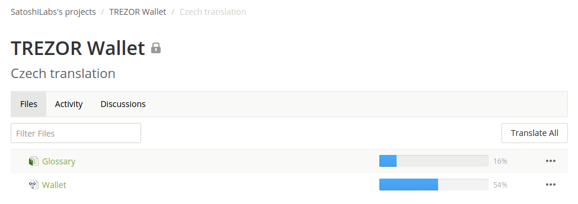

CrowdIn.com - Tool for translating
==================================

1. Register
-------------

Please register at `CrowdIn.com <https://crowdin.com/join>`_ and send a request email to `translations coordinator <mailto:translations@satoshilabs.com>`_ with the subject “Translation TREZOR Wallet (Language)”.

2. Join translation project
---------------------------

We will reply by sending you an invitation to the requested language. Please, Join TREZOR Wallet translation project in CrowdIn using the provided link and navigate to the requested language. The language in the example below is Czech.

.. important:: Please keep in mind the language you are selecting is actually the language you are going to translate **INTO**, not FROM. You will be always translating from English.

3. Translate
------------

.. note::  We recommend to write down notes while translating so you know how you translated specific words, helping the translation to remain consistent throughout the whole process. From our own experience, this can be quite helpful.

.. important:: In some languages might be an option to choose between "official" and "unofficial" way of speech. We prefer the more official, formal manner.

Please start by translating the Glossary. It is later used for consistency purpose. If the Glossary is fully translated, you can move on to translate the Wallet.

Please translate each string as precisely as possible, but the main point is to keep the **original meaning**. Following recommendations will help you understand the original phrases better and work more efficiently:

* Use Context description and screenshots to understand the translated string completely.
* Always check Terms tab (Glossary) to keep the translation consistent.
* Using automatic translations in Suggestions tab can speed up your work.

.. image:: images/crowdin-translation.png

You will also find strings which contain placeholders and HTML tags. In that case, copy the whole string and translate only things placed out of those placeholders. Take the following string as an example:

  <b>{{key}}</b> changed from <b>{{old}}</b> to <b>{{new}}</b>

Please translate "**changed from**" and "**to**" only. It does not matter where these special strings are in the translated string, as long as you keep them spelled properly. If your language requires a specific word order, you may shuffle them. Do not, however, split the placeholder tags.

Please report any inconsistencies, unclarities or mistakes in the English language (source) or in the UI.

* To report any particular issue or to suggest specific improvements, use the Comments tab during translation.
* To report a general issue, please use the `Discussions panel. <https://crowdin.com/project/trezor-wallet/discussions>`_

In case of any issues, difficulties or questions please check the `CrowdIn Documentation <https://support.crowdin.com/online-editor/>`_ or contact us via `Support <https://satoshilabs.kayako.com/conversation/new/2>`_

Reward
^^^^^^

For a complete translation of one language we offer a "TREZOR One" device of your color choice (Black or White).
